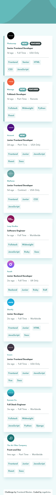
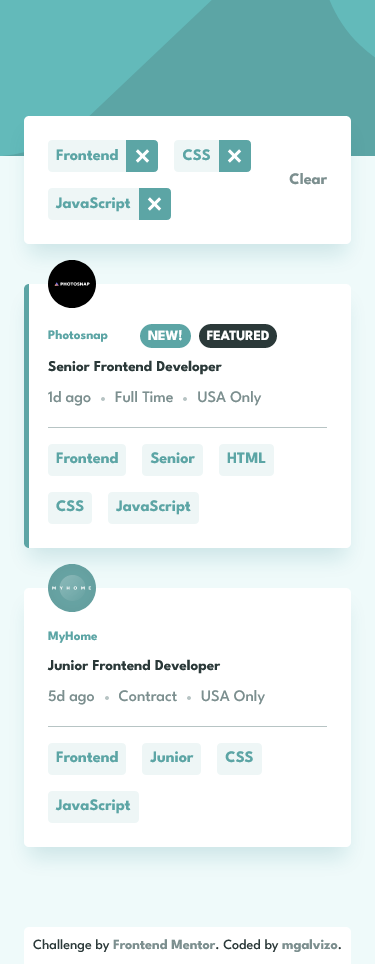
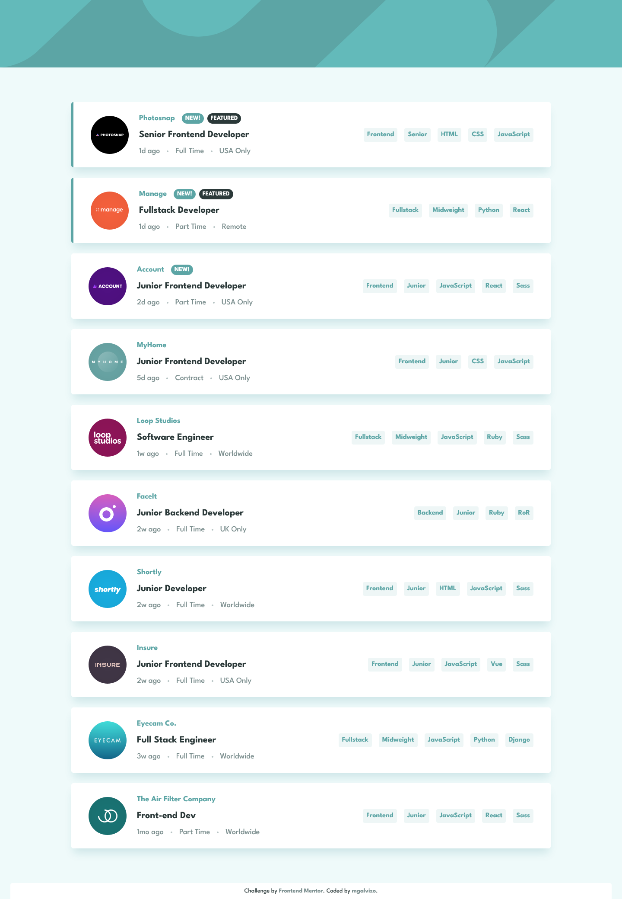
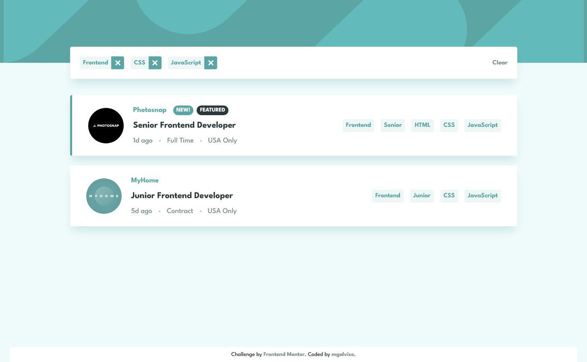

# Frontend Mentor - Job listings with filtering solution

This is a solution to the [Job listings with filtering challenge on Frontend Mentor](https://www.frontendmentor.io/challenges/job-listings-with-filtering-ivstIPCt). Frontend Mentor challenges help you improve your coding skills by building realistic projects.

## Table of contents

-   [Overview](#overview)
    -   [The challenge](#the-challenge)
    -   [Screenshot](#screenshot)
    -   [Links](#links)
-   [My process](#my-process)
    -   [Built with](#built-with)
    -   [What I learned](#what-i-learned)
    -   [Useful resources](#useful-resources)
-   [Author](#author)

## Overview

### The challenge

Users should be able to:

-   View the optimal layout for the site depending on their device's screen size
-   See hover states for all interactive elements on the page
-   Filter job listings based on the categories

### Screenshot

#### Mobile




#### Desktop




### Links

-   [Solution URL](https://your-solution-url.com)
-   [Live Site URL](https://mgalvizo.github.io/static-job-listings/)

## My process

### Built with

-   Semantic HTML5 markup
-   CSS custom properties
-   Flexbox
-   CSS Grid
-   Mobile-first workflow
-   [React](https://reactjs.org/)
-   [Styled Components](https://styled-components.com/)

### What I learned

I learned to extend styles of other styled-components in order to reuse some of them.

I used the ```every()``` method for the filtering logic to check if every added filter is included in a collection that contains the relevant tags of each job listing.

### Useful resources

-   [Styled Components Documentation](https://styled-components.com/docs/basics#extending-styles) - This helped me with the implementation of extending other styled-component styles.

## Author

-   Frontend Mentor - [@mgalvizo](https://www.frontendmentor.io/profile/mgalvizo)
